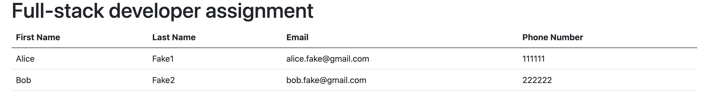

# Golang Engineering Assignment

## Instructions:

- Run the application: `go run main.go`
- Run all the tests: `go test .`

## Endpoints

After running the application at http://localhost:8080 we will have access to the following endpoints:

1. `/`
    * Get: will display a form to enter the data of a specific person  
      
    * Post: after clicking at submit but the entered data will be saved locally under `./data/forms.json`
2. `/data`
    * Get: will display all persons data at a table  
      

### Note

The application by default will run at port 8080, to change the port number create environment variable with the   
preferred port num or edit it at the `.env` file
